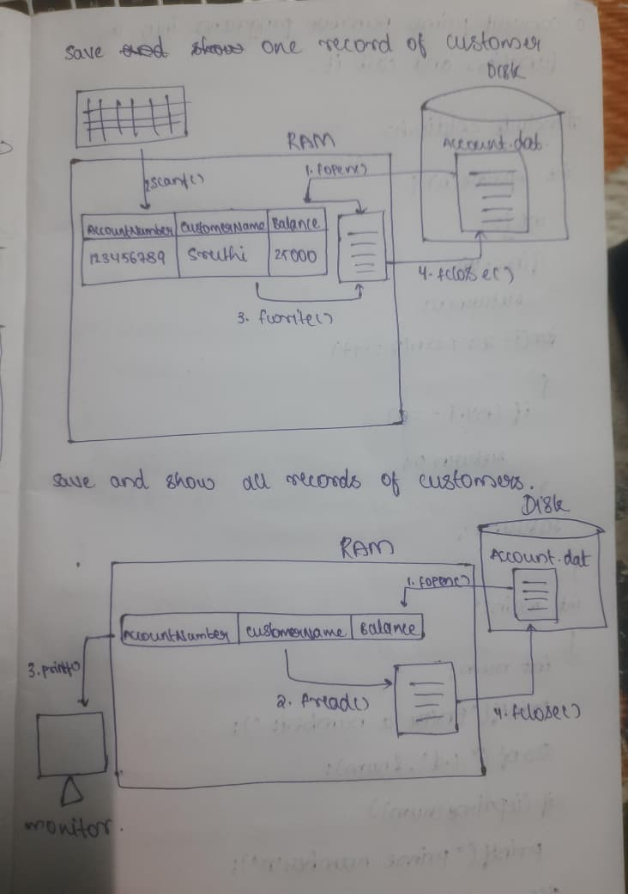

# Customer Account Records Program

## Description
This is a menu-driven program that reads, stores, and displays customer account details using file storage.  
The program allows the user to save multiple customer records and view all stored records.

## Program Functions
- Save customer account details
- Store records in a file
- Read and display all saved records
- Menu-based user selection

## Customer Data Stored
- Account Number
- Customer Name
- Account Balance

## Working of the Program
1. The program displays a menu with options.
2. The user selects an option:
   - Open a new customer record
   - Display all customer records
   - Exit the program
3. Based on the selection, the corresponding operation is performed.

## Concepts Used
- Structures
- File operations
- Functions
- Switch case
- Menu-driven logic

## Diagram
The diagram below shows how records are stored in memory and written to the file, and how records are read back and displayed.

